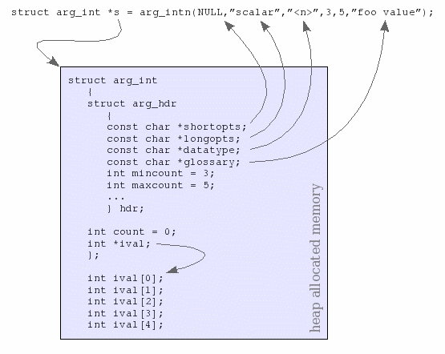

# 如何构建符合 POSIX 实用程序约定的Shell-CLI

## What is Argtable

Argtable是一款开源的ANSI C library，用来解析GNU样式的命令行选项。它通过定义可用于指定命令行语法的声明式API，从而简化了命令行的分析。
argtable将自动生成一致的错误处理逻辑和命令行语法的文本描述，这对于一个健壮的cli程序来说，是非常必要的，但是很繁琐。

## Introduction of Argtable3

解析程序的命令行一直以来都是一个分散注意力的主要编程任务。Argtable3 库通过允许程序员**将源代码中的命令行选项直接定义为静态的结构数组**来简化作业， 然后**
将该数组传递给argtable3库函数，这些函数就会相应地解析命令行。从命令行中提取的值直接保存到用户定义的程序变量中**，主程序就可以访问这些变量。
argtable3还可以从同一数组中生成命令行语法的描述，以便显示为联机帮助。根据第三条BSD许可条款，此库是免费的。 注意：**argtable3不向后兼容**。

## Quick Start

### demo code
+ 入门小例子
```c
// 引入 argtable3
#include "argtable3.h"

/* global arg_xxx structs */
struct arg_lit *help;
struct arg_end *end;

int main(int argc, char *argv[]) {
    /* the global arg_xxx structs are initialised within the argtable */
    void *argtable[] = {
            help = arg_litn(NULL, "help", 0, 1, "display this help and exit"),
            end = arg_end(20)
    };
    int exitcode = 0;
    char program[] = "argtable";
    arg_parse(argc, argv, argtable);
    /* special case: '--help' takes precedence over error reporting */
    if (help->count > 0) {
        printf("Usage: %s", program);
        arg_print_syntax(stdout, argtable, "\n");
        printf("Demonstrate command-line parsing in argtable3.\n\n");
        arg_print_glossary(stdout, argtable, "  %-25s %s\n");
        exitcode = 0;
        /* deallocate each non-null entry in argtable[] */
        arg_freetable(argtable, sizeof(argtable) / sizeof(argtable[0]));
    }
    return exitcode;
}
```

+ 运行
```shell
./argtable --help

# 输出
# Usage: argtable [--help]
# Demonstrate command-line parsing in argtable3.
#
#  --help                    display this help and exit
```

### how it works
Argtable3 提供了一组**arg_xxx结构**，一个用于它支持的每种类型的参数（**文字、整数、双精度、字符串、文件名**等），
并且每个结构都能够在命令行上处理该参数的多次出现。此外，**可以为每个选项提供可互换使用的替代短选项 (-x)或长选项 (--xx) 形式**。
事实上，每个选项甚至可以选择多个替代的短选项或长选项，或两者兼而有之。

要定义命令行选项，您必须为arg_xxx所需的每种类型的参数（**文字、整数、双精度、字符串、文件名**等）创建一个结构体，并将它们整理到我们称为参数表（**argument table**）的数组中。
参数表中结构的顺序定义了命令行选项的预期顺序，不过**解析顺序实际上只对未标记的选项重要**（和python的函数传参规则类似）。
**参数表本身只是一个void指针数组**（`void* arg_table[]`），
按照惯例，每个arg_xxx结构都有一个已知的**arg_hdr结构体**作为其第一个条目，Argtable3 函数使用它来标识结构体。

#### arg_hdr
```c
typedef struct arg_hdr {
    char flag;             /* Modifier flags: ARG_TERMINATOR, ARG_HASVALUE. */
    const char* shortopts; /* String defining the short options */
    const char* longopts;  /* String defiing the long options */
    const char* datatype;  /* Description of the argument data type */
    const char* glossary;  /* Description of the option as shown by arg_print_glossary function */
    int mincount;          /* Minimum number of occurences of this option accepted */
    int maxcount;          /* Maximum number of occurences if this option accepted */
    void* parent;          /* Pointer to parent arg_xxx struct */
    arg_resetfn* resetfn;  /* Pointer to parent arg_xxx reset function */
    arg_scanfn* scanfn;    /* Pointer to parent arg_xxx scan function */
    arg_checkfn* checkfn;  /* Pointer to parent arg_xxx check function */
    arg_errorfn* errorfn;  /* Pointer to parent arg_xxx error function */
    void* priv;            /* Pointer to private header data for use by arg_xxx functions */
} arg_hdr_t;
```
最基本的一个类型，所有的其他类型都包含这个类型。一一解释下里面的参数的含义:

+ shortopts: 参数的短名称，比如ls -a 中的a就是短名称;
+ longopts: 参数中的长名称，比如ls —all 中的all就是长名称;
+ datatype: 参数的数据类型有, , NULL, ,(时间类型传入format字符串),(rex类型传入匹配串),等;
+ glossary: 对于参数的描述;
+ mincount: 参数最少的个数(可以规定是否必须有参数比如设置为0为非必须，1…n为必须);
+ maxcount: 参数最多的个数，采用Unix风格的，如kernel.exe -l 1 -l 2 -l 3
+ 其他参数非必须。

#### arg_xxx结构体族
```c
// 整数
struct arg_int
{
    struct arg_hdr hdr;
    int count;
    int *ival;
};
// 文字
struct arg_lit
{
    struct arg_hdr hdr;
    int count;
};
// 双精度浮点数
struct arg_dbl
{
    struct arg_hdr hdr;
    int count;
    double *dval;
};
// 字符串
struct arg_str
{
    struct arg_hdr hdr;
    int count;
    const char **sval;
};

struct arg_rex
{
    struct arg_hdr hdr;
    int count;
    const char **sval;
};

struct arg_file
{
    struct arg_hdr hdr;
    int count;
    const char **filename;
    const char **basename;
    const char **extension;
};

struct arg_date
{
    struct arg_hdr hdr;
    const char *format;
    int count;
    struct tm *tm_val;
};
```

#### 详细介绍 arg_int
```c
struct arg_int
{
    struct arg_hdr hdr;
    int count;
    int *ival;
};
```
结构体的第一个数据成员hdr保存了 Argtable3 库函数使用的私有数据。它包含参数的标签字符串等内容（**可以理解为元数据**）。
直接公开地访问这些数据是可以的，但很少需要这样做。
它的ival成员变量指向持有从命令行提取出的数组，count为数组的长度。ival 数组的存储在arg_int构造时分配。
**这必须通过arg_int构造函数完成。**
注意，**你永远不应该自己手动实例化任何arg_xxx结构，而是始终使用提供的构造函数来分配结构，并在完成后使用 arg_freetable 释放它。**

+ 举例
```c
struct arg_int *s;
s = arg_intn(NULL, "scalar", "<n>", 3, 5, "foo value");
```
完成s后将指向一个包含5 个元素数组的内存块的结构体arg_int。
甚至，你还可以设置多个别名，短选项被赋予一串单个字符，而长选项被赋予一个逗号分隔的字符串。
例如：`s = arg_intn("kKx", "scalar,foo", "<n>", 3, 5, "foo value");`


如图所示，该`s->hdr`结构保留对构造函数的字符串参数的引用等。
该`s->count`变量初始化为零，因为它表示`s->ival`解析命令行后存储在数组中的有效值的数量。
`s->ival`数组的大小由`s->hdr.maxcount`给出。


+ 实例代码
```c
// 引入 argtable3
#include "argtable3.h"

/* global arg_xxx structs */
struct arg_int *int_arrays;
struct arg_end *end;

int main(int argc, char *argv[]) {
    /* the global arg_xxx structs are initialised within the argtable */
    void *argtable[] = {
            int_arrays = arg_intn("a", "array", "<number>", 2, 3, "please input an integer"),
            end = arg_end(20)
    };
    int exitcode = -1;
    int nerrors = arg_parse(argc, argv, argtable);
    if (nerrors == 0) {
        exitcode = 0;
        int *a = int_arrays->ival;
        int len = int_arrays->count;
        printf("input numbers are as following:\n");
        for (int i = 0; i < len; ++i) {
            printf("%d  ", a[i]);
        }
    }
    return exitcode;
}

```
```shell
# 运行
./argtable -a 1 -a 2 --array 3
# 输出
# input numbers are as following:
# 1  2  3  
```

其他的参数结构体使用方法大同小异。

#### The Argument Table (参数表)
在构建完各种类型参数的结构体之后，我们需要统一将它们组装到一个结构体数组里面，类型为`void **`。
```c
struct arg_lit *a = arg_litn("a", NULL, 0, 1, "the -a option");
struct arg_lit *b = arg_litn("b", NULL, 0, 1, "the -b option");
struct arg_lit *c = arg_litn("c", NULL, 0, 1, "the -c option");
struct arg_int *scal = arg_intn(NULL, "scalar", "<n>", 0, 1, "foo value");
struct arg_lit *verb = arg_litn("v", "verbose", 0, 1, "verbose output");
struct arg_file *o = arg_filen("o", NULL,"myfile", 0, 1, "output file");
struct arg_file *file = arg_filen(NULL, NULL, "<file>", 1, 2, "input files");
struct arg_end *end = arg_end(20);
// 这就是我们的参数列表
void *argtable[] = {a, b, c, scal, verb, o, file, end}; 
```

其中，`arg_end` 结构体是一个特殊的结构体，因为它不代表任何命令行选项。
它主要标记 argtable 数组的结尾，同时它也存储在处理命令行参数时遇到的任何解析器错误。
传递给arg_end构造函数的整数参数是它将存储的最大错误数，任何更多的错误都将被丢弃并替换为单个错误消息“错误太多”。
**`arg_end`必须要有。**

你还可以使用`arg_nullcheck`检查参数表中是否有空指针，（感觉这个功能很鸡肋）
```c
if (arg_nullcheck(argtable) != 0)
    printf("error: insufficient memory\n");
```

#### 解析命令行
我们使用`arg_parse`函数来做到这一点，它返回它遇到的解析错误的数量。
```c
int nerrors = arg_parse(argc, argv, argtable);
```
如果没有错误的话（`nerrors == 0`），那么我们已经成功解析了命令行,你想要在命令行中提取的数据也都存在了参数表这个`void**`里面，正常地访问它即可。

#### 设置默认值
对此的解决方法很简单，直接在调用`arg_parse`之前设置`arg_table`的值，在命令行中有用户输入的值才会被覆盖。
其余的，就是你一开始设置的默认值。

#### 错误处理
如果 arg_parse 函数报告错误，那么我们需要显示它们，因为 arg_parse 本身不会这样做。
使用`arg_print_errors`即可，arg_end的内部结构无需关心。
函数定义
```c
void arg_print_errors(FILE* fp, struct arg_end* end, const char* progname);
```
使用实例如：
```c
If (nerrors > 0)
    arg_print_errors(stdout, end, "myprog"); // stdout 文件描述符
```
arg_parse函数不打印错误消息是因为它可以被多次调用以使用替代参数表解析命令行，而不会过早显示无关的错误消息。
因此，我们可以为那些具有互斥命令行选项集的程序定义单独的参数表，依次尝试每个参数表，直到找到一个成功的候选者。
如果所有参数表都不能满足，那么我们可以选择打印所有参数表的错误消息，或者可能只显示与最匹配的错误信息。无论如何，我们可以控制显示哪些消息。


#### 显示选项语法及帮助
如果您希望您的程序显示在线帮助，您可以使用`arg_print_syntax`函数来显示从参数表派生的命令行语法。
该函数实际上有两种形式：
```c
void arg_print_syntax(FILE *fp, void **argtable, const char *suffix);
void arg_print_syntaxv(FILE *fp, void **argtable, const char *suffix);
```
你可以使用`void arg_print_glossary(FILE *fp, void **argtable, const char *format);`来输出提示。

在文章的开始的示例中已经展示过这两个函数的使用方法了，这里不再赘述。

#### 打扫干净
在我们的程序结束时，我们需要释放分配给每个arg_xxx结构的内存。我们可以通过分别调用`arg_freetable`来做到这一点，
但有函数可以更方便地为我们做到这一点。
```c
arg_freetable(argtable, sizeof(argtable) / sizeof(argtable[0]));
```
它将遍历一个参数表并代表我们调用它的每个元素。
请注意，第二个参数`sizeof(argtable)/sizeof(argtable[0])`仅表示 argtable 数组中的元素数。（使用了内存对齐？）
完成此功能后，所有 argtable 数组条目都将设置为NULL。


## 相关链接

[Argtable3教程介绍](https://www.argtable.org/tutorial/)
[github地址](https://github.com/argtable/argtable3/releases/)